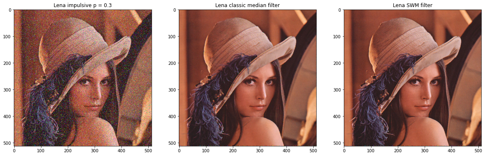
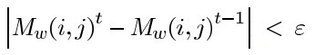
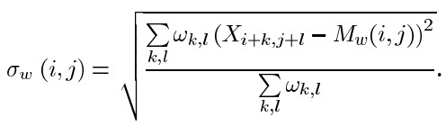
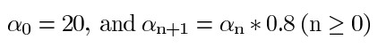
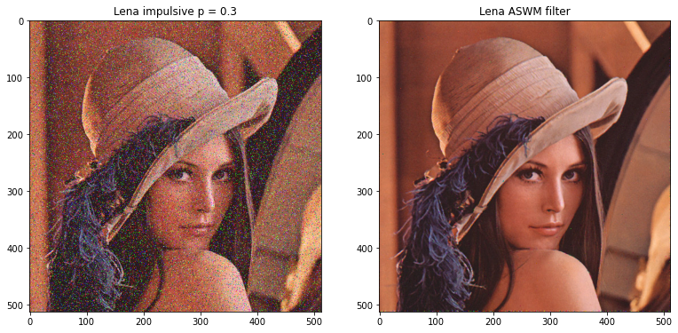
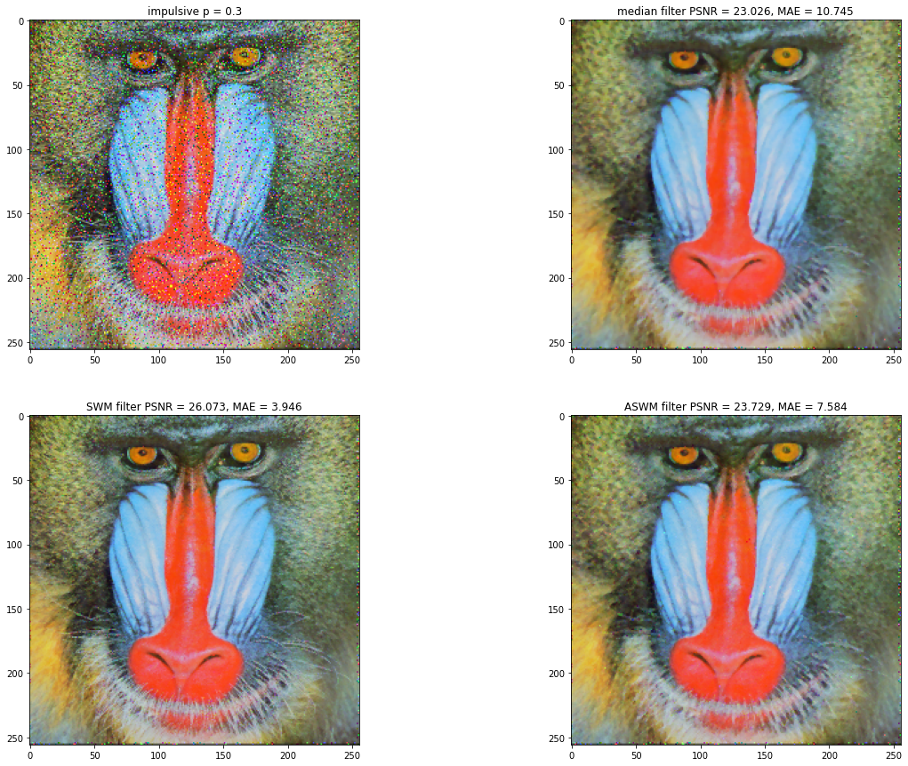
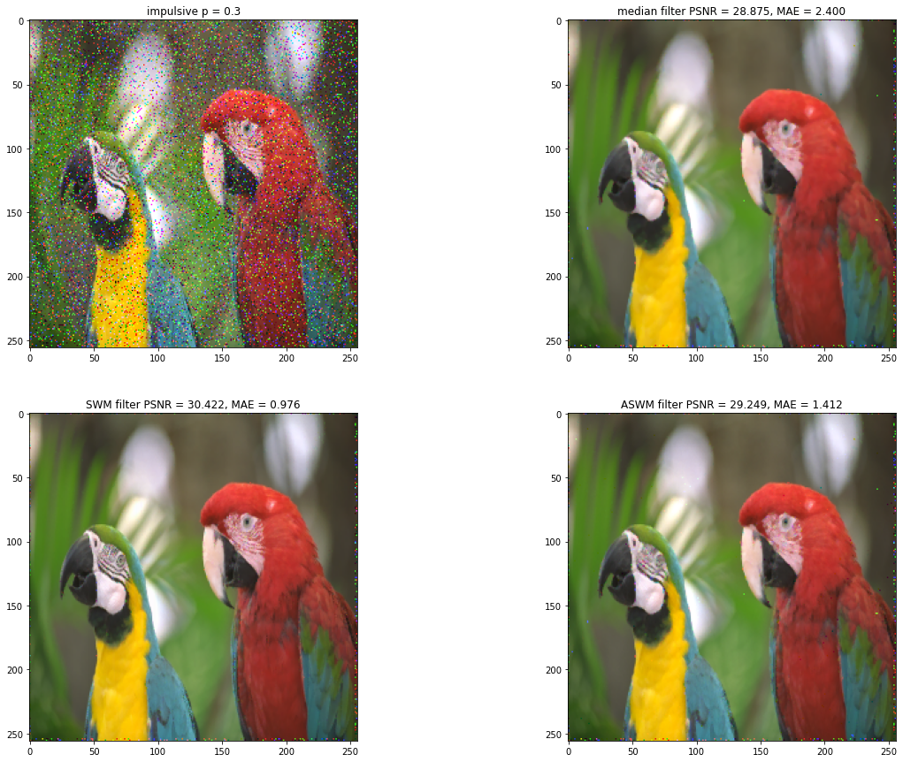

# Adaptive Switching Median Filter

Implementation of "A new adaptive switching median filter", by Akkoul, Smaïl, et al. [IEEE Signal Processing Letters 17.6 (2010)].<br/>Comparison between Adaptive Switching Median Filter (ASWM), Switching Median Filter (SWM) and classic Median Filter applied on images.

## Contents

- [Adaptive Switching Median Filter](#adaptive-switching-median-filter)
  - [Contents](#contents)
  - [Reading and displaying images](#reading-and-displaying-images)
  - [Defining the impulsive noise function (salt and pepper) and applying it to images](#defining-the-impulsive-noise-function-salt-and-pepper-and-applying-it-to-images)
  - [Implementation of classic median filters and SWM (Switching Median Filter)](#implementation-of-classic-median-filters-and-swm-switching-median-filter)
    - [The classic median filter](#the-classic-median-filter)
    - [Switching Median Filter - SWM](#switching-median-filter---swm)
    - [Applying classic median and SWM filters to an image](#applying-classic-median-and-swm-filters-to-an-image)
  - [Implementing the ASWM filter (from the article)](#implementing-the-aswm-filter-from-the-article)
      - [Initialization](#initialization)
      - [Step 1](#step-1)
      - [Step 2](#step-2)
      - [Step 3](#step-3)
      - [Step 4](#step-4)
    - [Applying the ASWM filter to an image](#applying-the-aswm-filter-to-an-image)
  - [Noise measurement functions (PSNR, MAE)](#noise-measurement-functions-psnr-mae)
  - [Comparison between the 3 filters: Median, SWM, ASWM](#comparison-between-the-3-filters-median-swm-aswm)
  - [Results](#results)
  - [Conclusions](#conclusions)
    - [Results](#results-1)
    - [Distortions](#distortions)
    - [Images with gray vs color levels](#images-with-gray-vs-color-levels)
    - [Performance](#performance)
  - [Bibliography](#bibliography)
  - [License](#license)

## Reading and displaying images


```python
from skimage import io, color, measure
import matplotlib.pyplot as plt
import numpy as np

dir_path = './images/'
img_names = ['lena_color_512.bmp', 'peppers_512.png', 'penguins_512.jpg',
             'baboon_512.png', 'lighthouse_512.bmp', 'parrots_512.bmp']

img_paths = [dir_path + _ for _ in img_names]

fig = plt.figure(figsize=(20, 15))

for i, img_path in enumerate(img_paths):
    img = io.imread(img_path)
    fig.add_subplot(2,3,i+1); plt.imshow(img)
```


​    

## Defining the impulsive noise function (salt and pepper) and applying it to images


```python
def sp_noise(img_orig, ratio = 0.1):
    img = img_orig.copy()
    l, c, ch = img.shape
    length = int(l * c * ratio)
    lin = np.random.randint(0, l, [length])
    col = np.random.randint(0, c, [length])
    up_down = np.random.randint(0, 2, [length])
    for i in range(length):
        img[lin[i], col[i], np.random.randint(0, 3)] = 255 * up_down[i]
    return img
```


```python
prob = 0.3

fig = plt.figure(figsize=(20, 15))

for i, img_path in enumerate(img_paths):
    img = io.imread(img_path)
    img_noise = sp_noise(img, prob)
    fig.add_subplot(2,3,i+1); plt.imshow(img_noise)
```


​    

## Implementation of classic median filters and SWM (Switching Median Filter)

### The classic median filter


```python
def median_filter(img):
    img_out = img.copy()
    
    l, c, ch = img_out.shape
    for k in range(ch):
        for i in range(1, l - 2):
            for j in range(1, c - 2):
                V = np.sort(img[i-1:i+2, j-1:j+2, k], axis = None)
                img_out[i, j, k] = V[4]
                
    return img_out.astype(np.uint8)
```

### Switching Median Filter - SWM

The SWM filter is more efficient in eliminating impulse noise and preserving image characteristics. The filter replaces a pixel damaged by the median or processed value of the neighboring pixel. Uncorrupted pixels are left unchanged [2].


where, $A_{ij}$ is the intensity of the central pixel in the filter window, $A_{min}$, $A_{max}$ and $A_{med}$ are the minimum, maximum, and average value of the pixels in the noisy image filtering window. $A_{i-1, j}$ is the intensity of the immediately adjacent pixel, already processed.

[2] *Pushpavalli, R., and G. Sivaradje. "Switching median filter for Image Enhancement." International Journal of Scientific & Engineering Research 3.2 (2012): 1-5.
Source: https://www.ijser.org/researchpaper/switching-median-filter-for-image-enhancement.pdf*


```python
def swm_filter(img):
    img_out = img.copy()
    
    l, c, ch = img_out.shape
    for k in range(ch):
        for i in range(1, l - 2):
            for j in range(1, c - 2):    
                V = np.sort(img[i-1:i+2, j-1:j+2, k], axis = None)
                V_min, V_max = V[0], V[-1]
                
                if V_min < img_out[i, j, k] < V_max:
                    pass # no filtering needed
                else:
                    median = V[4]
                    if median != V_min and median != V_max:
                        img_out[i, j, k] = median
                    else:
                        img_out[i, j, k] = img_out[i-1, j, k]
                
    return img_out.astype(np.uint8)
```

### Applying classic median and SWM filters to an image


```python
path = './images/'
img_path = path+'lena_color_512.bmp'

prob = 0.3

img = io.imread(img_path)
img_noise = sp_noise(img, prob)

img_median = median_filter(img_noise)
img_swm = swm_filter(img_noise)

fig = plt.figure(figsize=(20, 15))
fig.add_subplot(1,3,1).set_title(f'Lena impulsive p = {prob}'); plt.imshow(img_noise)
fig.add_subplot(1,3,2).set_title('Lena classic median filter'); plt.imshow(img_median)
fig.add_subplot(1,3,3).set_title('Lena SWM filter'); plt.imshow(img_swm)
```




## Implementing the ASWM filter (from the article)

The ASWM filter does not require an a priori threshold as in the case of a conventional switching median filter. Instead, the threshold is calculated locally from the image pixel intensity values in a sliding window. The results in the article show that ASWM offers better performance in terms of PSNR and MAE than many other median filter variants for impulse noise. In addition, the article states that the filter can store more details in a noisy environment.

For the ASWM filter, the weighted mean value and the weighted standard deviation are estimated in the current window. Weights are the inverse of the distance between the weighted average value of the pixels in a given window and the pixel considered. As a result, impulsive noise does not corrupt the determination of these threshold threshold statistics.

In each window, the weighted average is first iteratively estimated. Then the weighted standard deviation is calculated and the threshold is determined.

The steps of the algorithm are as follows:

#### Initialization

- For each window, the weighted mean value $ M_w $ will be calculated in a window of a chosen size (eg. `5x5`) that surrounds the current pixel in the image scrolling
  


where $X_{i,j}$ represents the brightness level of the pixel at position $ i, j $, and $ w_ {k, l} $ the weights of the pixels in that neighborhood (window), which are initially initialized by 1.

#### Step 1

- New weights are estimated based on $\delta$ *(delta)*, with a default value of $\delta = 0.1 $ to avoid divisions to zero


- Recalculate the weighted average value using the weighted mean formula used previously

#### Step 2

- Check the codition:



where $\epsilon$ *(epsilon)​* represents a default value equal to $\epsilon = 0.01$, and $ M_w(i, j)^t $, $M_w(i, j)^{t-1}$ represents the iteration weighted average value $ t $, respectively the previous iteration $ t-1 $.

- If the condition is true, then stop the iterations to recalculate the average value, and move on to the next step
- If the condition is not met, go back to step 1

#### Step 3

- Calculates the weighted standard deviation $\sigma_w(i, j)$ *(sigma)* for the current window



#### Step 4

- The following decision rule is used:


where $m_{i,j}$ represents the median of the current window $ W_ {i, j} $ and $\alpha$ represents a threshold (initialized with $\alpha = 20$) that decreases with each iteration by multiplying by 0.8.



- Go to the next pixel in the image and return to the initialization and step 1


```python
def ASWM_filter(img, delta = 0.1, error = 0.01):
    img_out = img.copy()
    l, c, ch = img_out.shape
    
    for k in range(ch):
        for i in range(1, l - 2):
            for j in range(1, c - 2):
                alpha = 20
                window = img[i-1:i+2, j-1:j+2, k]
                
                # Initialization
                weights = np.array([[[1] * 3] * 3])
                windowMean = np.sum(np.multiply(weights, window)) / np.sum(weights)
                    
                while True:
                    windowMeanOld = windowMean
                    
                    # Step 1: Estimate the weights
                    weights = 1 / (np.abs((window - windowMean)) + delta)
                    windowMean = np.sum(np.multiply(weights, window)) / np.sum(weights)
                    
                    # Step 2 condtion
                    if np.abs(windowMean - windowMeanOld) < error:
                        break
                    alpha *= 0.8
                
                windowStdDeviation = np.sqrt(np.sum(np.multiply(weights, (window - windowMean)**2)) / np.sum(weights))
                
                if np.abs(img_out[i, j, k] - windowMean) > (alpha * windowStdDeviation):
                    img_out[i, j, k] = np.sort(window, axis = None)[4]
                else:
                    img_out[i, j, k] = img_out[i, j, k]
                
    return img_out.astype(np.uint8)
```

ASWM filter test on a small (`64 x 64`) image for debugging purposes:


```python
from datetime import datetime
tic = datetime.now()

path = './images/'
img_path = path+'lena_color_64.bmp'

img = io.imread(img_path)
img_noise = sp_noise(img, 0.3)

ASWM_filter(img_noise)
print(f'Duration: {datetime.now() - tic}')
```

    Duration: 0:00:04.789234


### Applying the ASWM filter to an image


```python
from datetime import datetime
tic = datetime.now()

path = './images/'
img_path = path+'lena_color_512.bmp'

prob = 0.3

img = io.imread(img_path)
img_noise = sp_noise(img, prob)

img_ASWM = ASWM_filter(img_noise)

fig = plt.figure(figsize=(20, 15))
fig.add_subplot(1,2,1).set_title(f'Lena impulsive p = {prob}'); plt.imshow(img_noise)
fig.add_subplot(1,2,2).set_title('Lena ASWM filter'); plt.imshow(img_ASWM)

print(f'Duration: {datetime.now() - tic}')
```

    Duration: 0:04:53.220245



    

## Noise measurement functions (PSNR, MAE)


```python
# Mean squared error
def mse(imgInit, imgFinal): 
    r = np.asarray(imgInit, dtype=np.float64).ravel()
    c = np.asarray(imgFinal, dtype=np.float64).ravel()
    return np.mean(np.abs(r - c)**2)

# Peak signal-to-noise ratio
def PSNR(imgInit, imgFinal):
    rng = imgInit.max() - imgFinal.min()
    dv = (rng + 0.0)**2
    with np.errstate(divide='ignore'):
        rt = dv / mse(imgInit, imgFinal)
    return 10.0 * np.log10(rt)

# Mean absolute error
def MAE(imgInit, imgFinal):  
    r = np.asarray(imgInit, dtype=np.float64).ravel()
    c = np.asarray(imgFinal, dtype=np.float64).ravel()
    return np.mean(np.abs(r - c))
```

## Comparison between the 3 filters: Median, SWM, ASWM


```python
from datetime import datetime
from time import time

dir_path = './images/'
img_names = ['lena_color_256.bmp', 'peppers_256.png', 'penguins_256.jpg',
             'baboon_256.png', 'lighthouse_256.bmp', 'parrots_256.bmp']
img_paths = [dir_path + _ for _ in img_names]

prob = 0.3

for img_path in img_paths:
    tic = datetime.now()
    
    # Apply impulsive noise
    img = io.imread(img_path)
    img_noise = sp_noise(img, prob)
    
    # Apply filters
    time_med = time()
    img_median = median_filter(img_noise)
    time_med = time() - time_med
    
    time_swm = time()
    img_swm = swm_filter(img_noise)
    time_swm = time() - time_swm
    
    time_ASWM = time()
    img_ASWM = ASWM_filter(img_noise)
    time_ASWM = time() - time_ASWM
    
    # Compute PSNR, MAE
    img_median_PSNR = PSNR(img, img_median)
    img_median_MAE = MAE(img, img_median)
    
    img_swm_PSNR = PSNR(img, img_swm)
    img_swm_MAE = MAE(img, img_swm)
    
    img_ASWM_PSNR = PSNR(img, img_ASWM)
    img_ASWM_MAE = MAE(img, img_ASWM)
    
    # Show images
    fig = plt.figure(figsize=(20, 15))
    fig.add_subplot(2,2,1).set_title(f'impulsive p = {prob}'); plt.imshow(img_noise)
    fig.add_subplot(2,2,2).set_title(f'median filter PSNR = {img_median_PSNR:.3f}, MAE = {img_median_MAE:.3f}');
    plt.imshow(img_median)
    fig.add_subplot(2,2,3).set_title(f'SWM filter PSNR = {img_swm_PSNR:.3f}, MAE = {img_swm_MAE:.3f}');
    plt.imshow(img_swm)
    fig.add_subplot(2,2,4).set_title(f'ASWM filter PSNR = {img_ASWM_PSNR:.3f}, MAE = {img_ASWM_MAE:.3f}');
    plt.imshow(img_ASWM)
    
    # Print duration, PSNR & MAE values
    toc = datetime.now()
    print(f'{img_path}, Total duration: {toc - tic} ({time_med:.2f}s Median) ({time_swm:.2f}s SWM) ({time_ASWM:.2f}s ASWM)')
    print(f'Median_PSNR = {img_median_PSNR:.3f} dB, Median_MAE = {img_median_MAE:.3f}')
    print(f'SWM_PSNR = {img_swm_PSNR:.3f} dB, SWN_MAE = {img_swm_MAE:.3f}')
    print(f'ASWM_PSNR = {img_ASWM_PSNR:.3f} dB, ASWM_MAE = {img_ASWM_MAE:.3f}\n')
```

    ./images/lena_color_256.bmp, Total duration: 0:01:08.910994 (1.34s Median) (1.18s SWM) (66.12s ASWM)
    Median_PSNR = 27.931 dB, Median_MAE = 4.022
    SWM_PSNR = 29.772 dB, SWN_MAE = 1.601
    ASWM_PSNR = 28.521 dB, ASWM_MAE = 2.317
    
    ./images/peppers_256.png, Total duration: 0:01:08.746201 (1.04s Median) (1.18s SWM) (66.26s ASWM)
    Median_PSNR = 28.052 dB, Median_MAE = 3.161
    SWM_PSNR = 29.351 dB, SWN_MAE = 1.329
    ASWM_PSNR = 28.555 dB, ASWM_MAE = 1.714
    
    ./images/penguins_256.jpg, Total duration: 0:01:07.053629 (1.05s Median) (1.25s SWM) (64.51s ASWM)
    Median_PSNR = 26.627 dB, Median_MAE = 3.822
    SWM_PSNR = 28.640 dB, SWN_MAE = 1.656
    ASWM_PSNR = 27.070 dB, ASWM_MAE = 2.551
    
    ./images/baboon_256.png, Total duration: 0:01:10.993624 (1.09s Median) (1.19s SWM) (68.46s ASWM)
    Median_PSNR = 23.026 dB, Median_MAE = 10.745
    SWM_PSNR = 26.073 dB, SWN_MAE = 3.946
    ASWM_PSNR = 23.729 dB, ASWM_MAE = 7.584
    
    ./images/lighthouse_256.bmp, Total duration: 0:01:06.618931 (1.09s Median) (1.19s SWM) (64.08s ASWM)
    Median_PSNR = 25.699 dB, Median_MAE = 5.562
    SWM_PSNR = 27.479 dB, SWN_MAE = 2.353
    ASWM_PSNR = 26.266 dB, ASWM_MAE = 3.715
    
    ./images/parrots_256.bmp, Total duration: 0:01:08.024636 (1.14s Median) (1.20s SWM) (65.47s ASWM)
    Median_PSNR = 28.875 dB, Median_MAE = 2.400
    SWM_PSNR = 30.422 dB, SWN_MAE = 0.976
    ASWM_PSNR = 29.249 dB, ASWM_MAE = 1.412







## Results

Having the values PSNR, MAE for each of the displayed images, we can draw up the following table:

PSNR = Peak Signal to Noise Ratio [dB] - The higher the better<br/>
MAE = Mean Absolute Error - The lower the better<br/>

| Image / Filter |           | Median | SWM    | ASWM   |
|----------------|-----------|--------|--------|--------|
| lena_color_512 | PSNR (dB) | 29.902 | 32.153 | 30.783 |
|                | MAE       | 3.832  | 1.451  | 2.012  |
| peppers_512    | PSNR (dB) | 29.134 | 30.474 | 30.011 |
|                | MAE       | 4.044  | 1.789  | 2.109  |
| penguins_512   | PSNR (dB) | 28.246 | 30.464 | 28.837 |
|                | MAE       | 3.53   | 1.585  | 2.279  |
| baboon_512     | PSNR (dB) | 22.448 | 25.895 | 23.193 |
|                | MAE       | 11.728 | 4.102  | 8.285  |
| lighthouse_512 | PSNR (dB) | 27.315 | 28.982 | 28.085 |
|                | MAE       | 4.807  | 2.044  | 2.95   |
| parrots_512    | PSNR (dB) | 32.475 | 34.025 | 32.929 |
|                | MAE       | 1.529  | 0.631  | 0.744  |

<center>Results on 512x512 images with a probabilty of 30% random-valued impulsive noise</center>

<br/><br/>

We can run the tests again and draw up tables for lower resolution images as well:

| Image / Filter |           | Median | SWM    | ASWM     |
|----------------|-----------|--------|--------|----------|
| lena_color_256 | PSNR (dB) | 27.931 | 29.772 | 28.521   |
|                | MAE       | 4.022  | 1.601  | 2.317    |
|                | Time (s)  | 1.34s  | 1.18s  | 66.12s   |
| peppers_256    | PSNR (dB) | 28.052 | 29.351 | 28.555   |
|                | MAE       | 3.161  | 1.329  | 1.714    |
|                | Time (s)  | 1.04s  | 1.18s  | 66.26s   |
| penguins_256   | PSNR (dB) | 26.627 | 28.64  | 27.07    |
|                | MAE       | 3.822  | 1.656  | 2.551    |
|                | Time (s)  | 1.05s  | 1.25s  | 64.51s   |
| baboon_256     | PSNR (dB) | 23.026 | 26.073 | 23.729   |
|                | MAE       | 10.745 | 3.946  | 7.584    |
|                | Time (s)  | 1.09s  | 1.19s  | 68.46s   |
| lighthouse_256 | PSNR (dB) | 25.699 | 27.479 | 26.266   |
|                | MAE       | 5.562  | 2.353  | 3.715    |
|                | Time (s)  | 1.09s  | 1.19s  | 64.08s   |
| parrots_256    | PSNR (dB) | 28.875 | 30.422 | 29.249   |
|                | MAE       | 2.4    | 0.976  | 1.412    |
|                | Time (s)  | 1.14s  | 1.20s  | 65.47s   |

<center>Results on 256x256 images with a probabilty of 30% random-valued impulsive noise</center>

<br/><br/>

| Image / Filter |           | Median | SWM    | ASWM    |
|----------------|-----------|--------|--------|---------|
| lena_color_128 | PSNR (dB) | 26.113 | 27.49  | 26.473  |
|                | MAE       | 4.259  | 1.79   | 2.716   |
|                | Time (s)  | 0.25s  | 0.31s  | 16.87s  |
| peppers_128    | PSNR (dB) | 25.203 | 26.901 | 25.63   |
|                | MAE       | 4.336  | 1.734  | 1.734   |
|                | Time (s)  | 0.28s  | 0.29s  | 17.54s  |
| penguins_128   | PSNR (dB) | 24.306 | 26.353 | 24.659  |
|                | MAE       | 5.092  | 2.124  | 3.559   |
|                | Time (s)  | 0.27s  | 0.27s  | 16.07s  |
| baboon_128     | PSNR (dB) | 23.896 | 26.077 | 24.58   |
|                | MAE       | 8.988  | 3.46   | 6.121   |
|                | Time (s)  | 0.27s  | 0.29s  | 16.96s  |
| lighthouse_128 | PSNR (dB) | 25.147 | 26.814 | 25.685  |
|                | MAE       | 5.584  | 2.371  | 3.75    |
|                | Time (s)  | 0.26s  | 0.28s  | 16.30s  |
| parrots_128    | PSNR (dB) | 26.291 | 27.383 | 26.619  |
|                | MAE       | 3.398  | 1.459  | 2.135   |
|                | Time (s)  | 0.33s  | 0.33s  | 16.67s  |

<center>Results on 128x128 images with a probabilty of 30% random-valued impulsive noise</center>

<br/><br/>

## Conclusions

### Results

From the tables displayed above, we can see that the SWM (Medium Switching Filter) filter provides the best results in terms of the values of the Peak Signal-to-Noise Ratio and the absolute average error.

In each case we notice that the ASWM filter presented in the article still offers better results than the classic median filter, especially in cases where it is applied to higher resolution images (example `512x512` px).


### Distortions

Although the SWM filters images better based on PSNR, MAE values, when applied to certain images, some distortion may occur. For example, in the case of the `lighthouse.bmp` image, unusual streaks can be seen in the center of the headlight. These distortions may occur due to the luminance level of the previous pixel being taken over if the median value itself is "corrupted" (ie the median value in the window is equal to one of the values at the extremities, after sorting).

In the case of the classic median filter and ASWM, no noticeable distortions occur.

### Images with gray vs color levels

The algorithm in the article has been implemented in order to filter images with gray levels, so when applying the ASWM filter we should not expect better results for color images.

At the same time, considering this aspect, the results of the PSNR, MAE values in the article may differ from the results obtained previously in this project.

### Performance

The ASWM filter is the weakest in terms of performance, requiring a much higher computational time than the algorithms for the classic median filter, respectively SWM. We can take as an example the image `lena_color_256.bmp`, for which we obtained the times` (1.34s Median) `` (1.18s SWM) `` (66.12s ASWM) `, where the time required to calculate the application of the ASWM filter is approximately 55 times higher.

The ASWM filter provides an additional calculation to iteratively estimate the weights and the weighted average value and to calculate the weighted standard deviation for each window surrounding the current pixel. Thus the whole process brings very high computational costs compared to the classic median and SWM filters.

## Bibliography

[1] *Akkoul, Smaïl, et al. "A new adaptive switching median filter." IEEE Signal Processing Letters 17.6 (2010): 587-590.<br/>
Link: https://ieeexplore.ieee.org/abstract/document/5451149*

[2] *Pushpavalli, R., and G. Sivaradje. "Switching median filter for Image Enhancement." International Journal of Scientific & Engineering Research 3.2 (2012): 1-5.<br/>
Link: https://www.ijser.org/researchpaper/switching-median-filter-for-image-enhancement.pdf*

## License

Released under [MIT License](./LICENSE). Source code written by [me](https://github.com/radualexandrub). 
